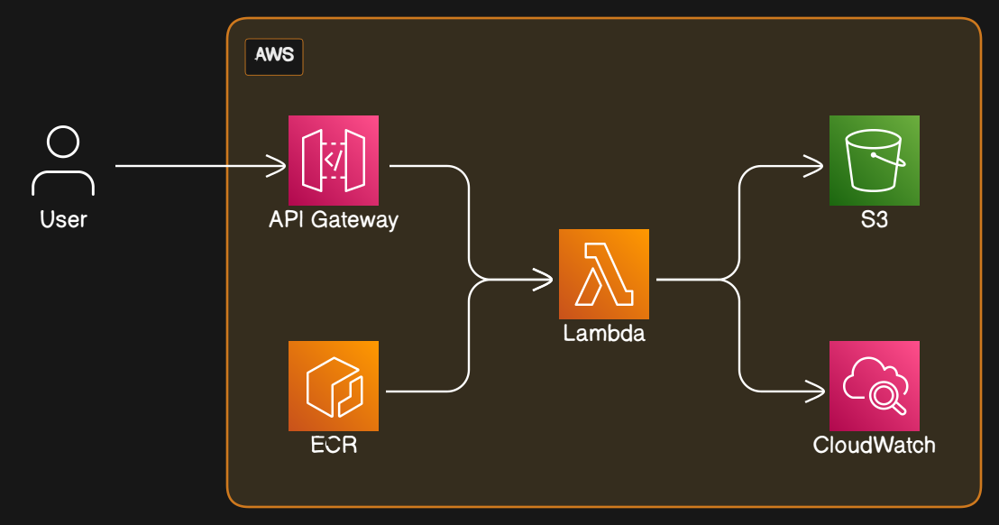

<h1 align="center">
  
</h1>

<p align="center">
  <i align="center">Instantly generate stems from YouTube videos with complet 🎸</i>
</p>

<h4 align="center">
  <a href="https://github.com/damarals/complet-api/actions/workflows/terraform_apply.yml">
    
  </a>
  <a href="https://github.com/damarals/complet-api/graphs/contributors">
    
  </a>
  <a href="https://opensource.org/license/mit/">
    
  </a>
</h4>

Complet is a music service that allows extracting the stems (vocals, drums, bass, other) from a YouTube video using deep learning powered by the spleeter model from Deezer. This makes it easy to recreate a full band sound even when some instruments are missing, by using the stems as backing tracks.

**This repository contains the API component of the complet service.**

## Features

- Extract stems from YouTube video via link 
- Return download links for each stem
- Store extracted stems on AWS S3
- Built with Python FastAPI framework
- Fully automated infrastructure as code (IaC) with Terraform
- CI/CD pipelines with GitHub Actions

## Usage

To extract stems from a YouTube video:

```
POST /stems
{
  "youtube_link": "https://youtu.be/..."  
}

RESPONSE:
{
  "stems": {
    "vocals": "https://s3.amazonaws.com/...",
    "drums": "https://s3.amazonaws.com/...", 
    "bass": "https://s3.amazonaws.com/...",
    "other": "https://s3.amazonaws.com/..."
  }
}
```

## Architecture

The complet API uses FastAPI to handle requests and run the spleeter model. The infrastructure is provisioned on AWS using Terraform modules. CI/CD pipelines deploy changes from GitHub dev/staging/prod branches.

<h1 align="center">
  
</h1>

The complet API infrastructure is provisioned on AWS using Terraform. User requests first reach the API Gateway, which handles API versioning - by default requests go to the /v1 stage endpoints.

API Gateway triggers a Lambda function containing the FastAPI application code running in a Docker container stored in ECR. This serverless function handles the API logic and stem extraction using the spleeter model.

Extracted audio stems are uploaded to an S3 bucket for persistent storage. Download URLs for the stems are returned in the API response.

Terraform state is stored remotely in S3, with separate state buckets for each environment (dev, staging, prod). This allows independent infrastructure for each stage following Git branching workflow.

Storing Terraform state remotely enables a consistent view of infrastructure and prevents state duplication. Infrastructure changes can be applied predictably through CI/CD pipelines using the same configured backend.

<!-- TODO: make cotributing section -->
<!-- ## Contributing -->

<!-- Contributions to the complet API are welcome! Please check out the [contributing guide](CONTRIBUTING.md) for more info on how to get started. -->

## License

This project is licensed under the MIT license. See [LICENSE](LICENSE) for details.

## Resources

- [FastAPI docs](https://fastapi.tiangolo.com/)
- [Terraform docs](https://www.terraform.io/docs)
- [Deezer spleeter model](https://github.com/deezer/spleeter)
